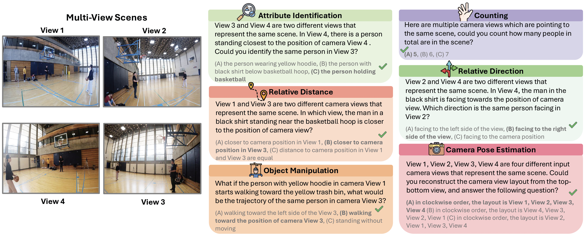

# Seeing from Another Perspective: Evaluating Multi-View Understanding in MLLMs


[Chun-Hsiao Yeh*](https://danielchyeh.github.io/), [Chenyu Wang*](https://scholar.google.com/citations?user=ZkCLeicAAAAJ&hl=en), [Shengbang Tong](https://tsb0601.github.io/), [Ta-Ying Cheng](https://ttchengab.github.io/), [Ruoyu Wang](https://scholar.google.com/citations?user=V5H0P28AAAAJ), [Tianzhe Chu](https://tianzhechu.com/), [Yuexiang Zhai](https://yx-s-z.github.io/), [Yubei Chen](https://yubeichen.com/), [Shenghua Gao](https://svip-lab.github.io/), [Yi Ma](https://people.eecs.berkeley.edu/~yima/).(*Equal Contribution)

UC Berkeley, TranscEngram, NYU, University of Oxford, UC Davis, HKU


-----
<a href='https://next-gpt.github.io/'></a>
<a href='https://arxiv.org/pdf/2401.10727'></a>  
<a href='https://arxiv.org/pdf/2401.10727'></a> 
<a href="https://huggingface.co/collections/tianzhechu/sftvsrl-models-and-data-6797ba6de522c7de7fcb80ba"></a>

<p align="center" width="100%">
<a target="_blank"></a>
</p>

📌 **A Benchmark for Multi-View Understanding:** We introduce <i>All-Angles Bench</i>, a large-scale benchmark with over 2,100 human-annotated multi-view QA pairs across 90 real-world scenes.

📊 **Performance Evaluation:** We benchmark 27 leading MLLMs, including Gemini-2.0-Flash, Claude-3.7-Sonnet, and GPT-4o. Our results reveal a substantial gap between MLLMs and human.

🔍 **Decoding MLLM Shortcomings:** We identify two major failure modes in MLLMs: (1) weak cross-view correspondence under occlusions and (2) poor estimation of coarse camera poses.


-----------

## 🎉 News 
- [x] [2025.04] 📢📢 Release the All-Angles Benchmark on HuggingFace.
- [x] [2025.04] 📢📢 Release the evaluation code on Github.

-----------

## All-Angles Bench
<p align="center" width="100%">
<a target="_blank"></a>
</p>

**Benchmark Overview:** We introduce All-Angles Bench, a benchmark designed to evaluate the multi-view reasoning capabilities of MLLMs, containing <b>2,132</b> question-answer pairs carefully annotated across <b>90</b> diverse real-world scenes sourced from EGO4D-EXO and EgoHumans. All-Angles Bench comprises six challenging tasks including <b><i>counting, attribute identification, relative distance, relative direction, manipulation, and camera pose estimation</i></b>.These question types are designed to investigate several major aspects of 3D scene understanding, from creating correspondence between objects to associating relative object and camera poses.


<span id='Usage'/>

## Getting Started


<span id='all_catelogue'/>

### Table of Contents:
* <a href='#Code Structure'>1. Code Structure</a>
* <a href='#Environment Preparation'>2. Environment Preparation </a>


<span id='Code Structure'/>

### 1. Code Structure 

```
├── data
│   ├── IT_data_ins                           # instruction data
│   │   └── T+X-T_data                        # text+[image/audio/video] to text instruction data
│   │   │   ├── mm_dataset                    # multimodal input data
│   │   │   ├── audio_tx2t.json
│   │   │   ├── image_tx2t.json
│   │   │   ├── text_t2t.json
│   │   │   ├── video_tx2t.json
│   │   │   └── combined_data.json
├── code
│   ├── config
│   │   ├──__init__.py
│   │   ├── base.yaml                         # the model configuration 
│   │   └── openllama_peft.yaml               # instruction-tuning configuration
│   ├── dsconfig
│   │   └──  openllama_peft_stage_1.json      # deepspeed configuration for instruction-tuning training
│   ├── dataset
│   │   ├──__init__ .py
│   │   ├──_sampler.py
│   │   ├──_utils.py
│   │   ├── catalog.py                        # the catalog information of the dataset
│   │   ├── T+X-T_instruction_dataset.py      # process and load text+x-to-text instruction dataset
│   │   └── concat_dataset.py                 # process and load multiple datasets
│   ├── model                     
│   │   ├── ImageBind                         # the code from ImageBind Model
│   │   ├──__init__ .py 
│   │   ├── openllama.py                      # the main model file
│   │   ├── agent.py
│   │   └── modeling_llama.py
│   ├── scripts
│   │   └── train.sh                          # training MLLM-Tool script
│   ├── header.py
│   ├── train_sft.py                          # training
│   └── inference.py                          # inference
├── pretrained_checkpoint                     # frozen params of pretrained modules
│   ├── imagebind_ckpt
│   │   ├──huge                               # version
│   │   │   └──imagebind_huge.pth
│   ├── LLM_ckpt
│   │   ├── vicuna_7b
│   │   │   ├── config.json
│   │   │   ├── pytorch_model-00001-of-00002.bin
│   │   │   ├── tokenizer.model
│   │   │   └── ...
│   │   └── ...
├── LICENCE.md
├── README.md
└── requirements.txt
```

<span id='Environment Preparation'/>

### 2. Environment Preparation  <a href='#all_catelogue'>[Back to Top]</a>
Please first clone the repo and install the required environment, which can be done by running the following commands:
```
conda create -n MLLM-Tool python=3.8

conda activate MLLM-Tool

# CUDA 11.7
pip install torch==2.0.1+cu117 torchvision==0.15.2+cu117 torchaudio==2.0.2 --index-url https://download.pytorch.org/whl/cu117

git clone https://github.com/MLLM-Tool/MLLM-Tool.git
cd MLLM-Tool

pip install -r requirements.txt 

conda install -c conda-forge cartopy
conda install -c conda-forge pycocotools
```

---------

## Contact

For any questions or feedback, feel free to contact [Chun-Hsiao Yeh](daniel_yeh@berkeley.edu) and [Chenyu Wang](chenyuwang5562@gmail.com).

## Citation

 If you find All-Angles Bench useful in your research or applications, please kindly cite:
```
@article{yeh2025seeing,
  title={Seeing from Another Perspective: Evaluating Multi-View Understanding in MLLMs},
  author={Chun-Hsiao Yeh, Chenyu Wang, Shengbang Tong, Ta-Ying Cheng, Rouyu Wang, Tianzhe Chu, Yuexiang Zhai, Yubei Chen, Shenghua Gao and Yi Ma},
  journal={arXiv preprint arXiv:2401.10727},
  year={2025}
}
```


## Acknowledgements
You may refer to related work that serves as foundations for our framework and code repository, 
[VLMEvalKit](https://github.com/open-compass/VLMEvalKit). 
We also partially draw inspiration from 
[PandaGPT](https://github.com/yxuansu/PandaGPT), 
[MiniGPT-4](https://github.com/Vision-CAIR/MiniGPT-4),
[LLaVA](https://github.com/haotian-liu/LLaVA),
[NeXT-GPT](https://github.com/NExT-GPT/NExT-GPT).
Thanks for their wonderful work.


## License Notices
This repository is under MIT License.
All-Angles Bench is a research project intended for non-commercial use only. 
One must NOT use the code of All-Angles Bench for any illegal, harmful, violent, racist, or sexual purposes. 
One is strictly prohibited from engaging in any activity that will potentially violate these guidelines.
Any potential commercial use of this code should be approved by the authors.
