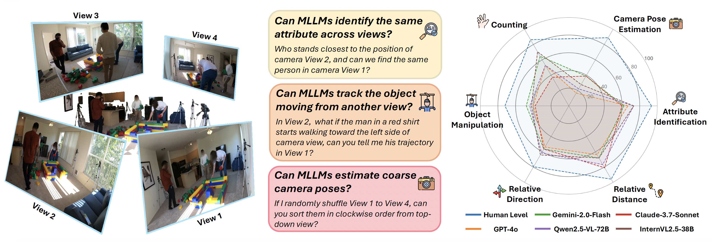

# Seeing from Another Perspective: Evaluating Multi-View Understanding in MLLMs


[Chun-Hsiao Yeh*](https://danielchyeh.github.io/)<sup>1</sup>, [Chenyu Wang*](https://scholar.google.com/citations?user=ZkCLeicAAAAJ&hl=en)<sup>2</sup>, [Shengbang Tong](https://tsb0601.github.io/)<sup>3</sup>, [Ta-Ying Cheng](https://ttchengab.github.io/)<sup>4</sup>, [Ruoyu Wang](https://scholar.google.com/citations?user=V5H0P28AAAAJ)<sup>2</sup>, [Tianzhe Chu](https://tianzhechu.com/)<sup>6</sup>, [Yuexiang Zhai](https://yx-s-z.github.io/)<sup>1</sup>, [Yubei Chen](https://yubeichen.com/)<sup>5</sup>, [Shenghua Gao](https://svip-lab.github.io/)<sup>2,6</sup>, [Yi Ma](https://people.eecs.berkeley.edu/~yima/)<sup>1,2,6</sup>.

<sup>1</sup>UC Berkeley, <sup>2</sup>TranscEngram, <sup>3</sup>NYU, <sup>4</sup>University of Oxford, <sup>5</sup>UC Davis, <sup>6</sup>HKU

(*Equal Contribution)

-----
<a href='https://next-gpt.github.io/'></a>
<a href='https://arxiv.org/pdf/2401.10727'></a>  
<a href='https://arxiv.org/pdf/2401.10727'></a> 
<a href="https://huggingface.co/collections/tianzhechu/sftvsrl-models-and-data-6797ba6de522c7de7fcb80ba"></a>

<p align="center" width="100%">
<a target="_blank"></a>
</p>

📌 **A Benchmark for Multi-View Understanding:** We introduce <i>All-Angles Bench</i>, a large-scale benchmark with over 2,100 human-annotated multi-view QA pairs across 90 real-world scenes.

📊 **Performance Evaluation:** We benchmark 27 leading MLLMs, including Gemini-2.0-Flash, Claude-3.7-Sonnet, and GPT-4o. Our results reveal a substantial gap between MLLMs and human.

🔍 **Decoding MLLM Shortcomings:** We identify two major failure modes in MLLMs: (1) weak cross-view correspondence under occlusions and (2) poor estimation of coarse camera poses.


-----------

## 🎉 News 
- [x] [2025.03.14] 📢📢 Release the All-Angles Benchmark on HuggingFace.
- [x] [2025.03.14] 📢📢 Release the evaluation code on Github.

-----------

## All-Angles Bench
<p align="center" width="100%">
<a target="_blank"></a>
</p>

**Benchmark Overview:** We introduce All-Angles Bench, a benchmark designed to evaluate the multi-view reasoning capabilities of MLLMs, containing <b>2,132</b> question-answer pairs carefully annotated across <b>90</b> diverse real-world scenes sourced from EGO4D-EXO and EgoHumans. All-Angles Bench comprises six challenging tasks including <b><i>counting, attribute identification, relative distance, relative direction, manipulation, and camera pose estimation</i></b>.These question types are designed to investigate several major aspects of 3D scene understanding, from creating correspondence between objects to associating relative object and camera poses.


<span id='Usage'/>

## Getting Started


<span id='all_catelogue'/>

### Table of Contents:
* <a href='#Code Structure'>1. Code Structure</a>
* <a href='#Environment Preparation'>2. Environment Preparation </a>
* <a href='#Training on Your Own'>3. Training/Adapting MLLM-Tool on Your Own</a>
  * <a href='#Prepare Pre-trained Checkpoint'>3.1. Preparing Pre-trained Checkpoint</a>
  * <a href='#Prepare Dataset'>3.2. Preparing Dataset </a>
  * <a href='#Train MLLM-Tool'>3.3. Training MLLM-Tool</a>
* <a href='#Run MLLM-Tool System'>4. Running MLLM-Tool System</a>
  * <a href='#Prepare checkpoints'>4.1. Preparing checkpoints</a>
  * <a href='#Inference'>4.2. Inference</a>

****


<span id='Code Structure'/>

### 1. Code Structure 

```
├── data
│   ├── IT_data_ins                           # instruction data
│   │   └── T+X-T_data                        # text+[image/audio/video] to text instruction data
│   │   │   ├── mm_dataset                    # multimodal input data
│   │   │   ├── audio_tx2t.json
│   │   │   ├── image_tx2t.json
│   │   │   ├── text_t2t.json
│   │   │   ├── video_tx2t.json
│   │   │   └── combined_data.json
├── code
│   ├── config
│   │   ├──__init__.py
│   │   ├── base.yaml                         # the model configuration 
│   │   └── openllama_peft.yaml               # instruction-tuning configuration
│   ├── dsconfig
│   │   └──  openllama_peft_stage_1.json      # deepspeed configuration for instruction-tuning training
│   ├── dataset
│   │   ├──__init__ .py
│   │   ├──_sampler.py
│   │   ├──_utils.py
│   │   ├── catalog.py                        # the catalog information of the dataset
│   │   ├── T+X-T_instruction_dataset.py      # process and load text+x-to-text instruction dataset
│   │   └── concat_dataset.py                 # process and load multiple datasets
│   ├── model                     
│   │   ├── ImageBind                         # the code from ImageBind Model
│   │   ├──__init__ .py 
│   │   ├── openllama.py                      # the main model file
│   │   ├── agent.py
│   │   └── modeling_llama.py
│   ├── scripts
│   │   └── train.sh                          # training MLLM-Tool script
│   ├── header.py
│   ├── train_sft.py                          # training
│   └── inference.py                          # inference
├── pretrained_checkpoint                     # frozen params of pretrained modules
│   ├── imagebind_ckpt
│   │   ├──huge                               # version
│   │   │   └──imagebind_huge.pth
│   ├── LLM_ckpt
│   │   ├── vicuna_7b
│   │   │   ├── config.json
│   │   │   ├── pytorch_model-00001-of-00002.bin
│   │   │   ├── tokenizer.model
│   │   │   └── ...
│   │   └── ...
├── LICENCE.md
├── README.md
└── requirements.txt
```

<span id='Environment Preparation'/>

### 2. Environment Preparation  <a href='#all_catelogue'>[Back to Top]</a>
Please first clone the repo and install the required environment, which can be done by running the following commands:
```
conda create -n MLLM-Tool python=3.8

conda activate MLLM-Tool

# CUDA 11.7
pip install torch==2.0.1+cu117 torchvision==0.15.2+cu117 torchaudio==2.0.2 --index-url https://download.pytorch.org/whl/cu117

git clone https://github.com/MLLM-Tool/MLLM-Tool.git
cd MLLM-Tool

pip install -r requirements.txt 

conda install -c conda-forge cartopy
conda install -c conda-forge pycocotools
```

<span id='Training on Your Own'/>

### 3. Training/Adapting Your Own MLLM-Tool 

<span id='Prepare Pre-trained Checkpoint'/>

#### 3.1. Preparing Pre-trained Checkpoint  <a href='#all_catelogue'>[Back to Top]</a>
Please follow the instructions to prepare the ImageBind and Large Language Models(LLM) checkpoints.

- `ImageBind`
The pre-trained checkpoint can be downloaded from [here](https://dl.fbaipublicfiles.com/imagebind/imagebind_huge.pth) with version `huge`. Afterward, put the `imagebind_huge.pth` file at [[./ckpt/pretrained_ckpt/imagebind_ckpt/huge]](ckpt/pretrained_ckpt/imagebind_ckpt/). 
- `Large Language Models`:
first prepare the LLaMA by following the instructions [[here]](ckpt/pretrained_ckpt/prepare_vicuna.md). Then put the pre-trained model at [[./ckpt/pretrained_ckpt/llm_ckpt/]](ckpt/pretrained_ckptllm_ckpt/). 

|**Base Language Model**|**Maximum Sequence Length**|**Huggingface Delta Weights Address**|
|:-------------:|:-------------:|:-------------:|
|Vicuna-7B |512|[lmsys/vicuna-7b-v1.5](https://huggingface.co/lmsys/vicuna-7b-v1.5)|
|Vicuna-13B|512|[lmsys/vicuna-13b-v1.5](https://huggingface.co/lmsys/vicuna-13b-v1.5)|
|Llama-7B |512|[huggyllama/llama-7b](https://huggingface.co/huggyllama/llama-7b)|
|Llama-13B |512|[huggyllama/llama-13b](https://huggingface.co/huggyllama/llama-13b)|
|Llama2-7B |512|[meta-llama/Llama-2-7b-hf](https://huggingface.co/meta-llama/Llama-2-7b-hf)|
|Llama2-13B|512|[meta-llama/Llama-2-13b-hf](https://huggingface.co/meta-llama/Llama-2-13b-hf)|
|Llama2-Chat-7B|512|[meta-llama/Llama2-7b-chat-hf](https://huggingface.co/meta-llama/Llama-2-7b-chat-hf)|
|Llama2-Chat-13B|512|[meta-llama/Llama-2-13b-chat-hf](https://huggingface.co/meta-llama/Llama-2-13b-chat-hf)|


<span id='Prepare Dataset'/>

#### 3.2. Preparing Dataset  <a href='#all_catelogue'>[Back to Top]</a>
Please download the following datasets used for model training and testing from [here](https://drive.google.com/drive/folders/1xd8y4gzWIXGS3zHCv-AEIBT2taDUOZAp?usp=drive_link):

After downloading the dataset, please put it under the path [data/IT_data_ins/T+X-T_data/]
    
<span id='Train MLLM-Tool'/>

#### 3.3. Training MLLM-Tool  <a href='#all_catelogue'>[Back to Top]</a>

First of all, please refer to the base configuration file [[./code/config/base.yaml]](./code/config/base.yaml) for the basic system setting of overall modules.

Then, the training of MLLM-Tool starts with this script(We take the example of using Vicuna-7B as the backbone and use 4 GPUs):
```angular2html
cd ./code
bash scripts/train.sh
```
Specifying the command:
```angular2html
deepspeed --include localhost:0,1,2,3 --master_addr 127.0.0.1 --master_port 28459 train_sft.py \
    --model openllama_peft \
    --stage 1\
    --imagebind_ckpt_path ../pretrained_checkpoint/imagebind_ckpt/\
    --llm_ckpt_path ../pretrained_checkpoint/LLM_ckpt/vicuna_7b/\
    --max_tgt_len 512\
    --epochs 5\
    --save_path  ../ckpt/mllmtool_vicuna_7b/\
    --log_path ../ckpt/mllmtool_vicuna_7b/log/\
    --version v1
```
where the key arguments are:
- `--include`: `localhost:0` indicating the GPT cuda number `0` of deepspeed.
- `--stage`: training stage.
- `--imagebind_ckpt_path`: the directory which saves the pretrained imagebind weights.
- `--llm_ckpt_path`: the directory which saves the pretrained large language model weights. You can replace the Vicuna-7B to any other LLMs.
- `--max_tgt_len`: the maximum sequence length.
- `--epochs`: the number of training epochs.
- `--save_path`: the directory which saves the trained delta weights. This directory will be automatically created.
- `--log_path`: the directory which saves the log file.
- `--version`: the name of the checkpoint file.


The whole MLLM-Tool training involves:

- **Step-1**: Instruction Tuning. This stage instruction-tune 1) the ***LLM*** via LoRA, 2) ***input projection layer*** on the ToolMMBench dataset.

  Just run the above `train.sh` script.

  Also refer to the running config file [[./code/config/openllama_peft.yaml]](./code/config/openllama_peft.yaml) and deepspeed config file [[./code/dsconfig/openllama_peft_stage_1.yaml]](./code/dsconfig/openllama_peft_stage_1.yaml) for detailed configurations. Pay attention to the *train_batch_size*, *train_micro_batch_size_per_gpu*, *gradient_accumulation_steps* in the deepspeed config file [[./code/dsconfig/openllama_peft_stage_1.yaml]](./code/dsconfig/openllama_peft_stage_1.yaml), you need to adjust the value to match your computing resources. In this work, we set 64, 4, 4 for 7B models and 32, 1, 8 for 13B models respectively.


Note: We extract the embedding of all the video data and store [here](https://drive.google.com/drive/folders/1Hn9uQTouH2DN4nZDY_upVA0-mjrWihh4?usp=drive_link), in case there may exists some problems when getting the video embeddings.

<span id='Run MLLM-Tool System'/>

## 4. Evaluating your own MLLM-Tool system

<span id='Prepare checkpoints'/>

#### 4.1. Preparing Checkpoints<a href='#all_catelogue'>[Back to Top]</a>

You can either 1) use the params trained yourselves, or 2) download our checkpoints from [here](https://drive.google.com/drive/folders/1hEWOe25LitkL8Y4aYqwN_V2wfnTyL4TO?usp=drive_link).

The checkpoints should be stored under the path [code/ckpt/]

<span id='Inference'/>

#### 4.2. Inference <a href='#all_catelogue'>[Back to Top]</a>

The inference of MLLM-Tool starts with this script(Again, we take the example of Vicuna-7B as backbone):
```angular2html
python inference.py
```

The prediction output would save in the format of JSON under the path [data/inference/]. Specifically, the format would be 
```angular2html
   "question_id": idx,
   "questions": prompt,
   "response": output,
```

---------

## Contact

For any questions or feedback, feel free to contact [Chun-Hsiao Yeh](daniel_yeh@berkeley.edu) and [Chenyu Wang](chenyuwang5562@gmail.com).

## Citation

 If you find All-Angles Bench useful in your research or applications, please kindly cite:
```
@article{yeh2025seeing,
  title={Seeing from Another Perspective: Evaluating Multi-View Understanding in MLLMs},
  author={Chun-Hsiao Yeh, Chenyu Wang, Shengbang Tong, Ta-Ying Cheng, Rouyu Wang, Tianzhe Chu, Yuexiang Zhai, Yubei Chen, Shenghua Gao and Yi Ma},
  journal={arXiv preprint arXiv:2401.10727},
  year={2025}
}
```


## Acknowledgements
You may refer to related work that serves as foundations for our framework and code repository, 
[VLMEvalKit](https://github.com/open-compass/VLMEvalKit). 
We also partially draw inspiration from 
[PandaGPT](https://github.com/yxuansu/PandaGPT), 
[MiniGPT-4](https://github.com/Vision-CAIR/MiniGPT-4),
[LLaVA](https://github.com/haotian-liu/LLaVA),
[NeXT-GPT](https://github.com/NExT-GPT/NExT-GPT).
Thanks for their wonderful work.


## License Notices
This repository is under MIT License.
All-Angles Bench is a research project intended for non-commercial use only. 
One must NOT use the code of All-Angles Bench for any illegal, harmful, violent, racist, or sexual purposes. 
One is strictly prohibited from engaging in any activity that will potentially violate these guidelines.
Any potential commercial use of this code should be approved by the authors.
